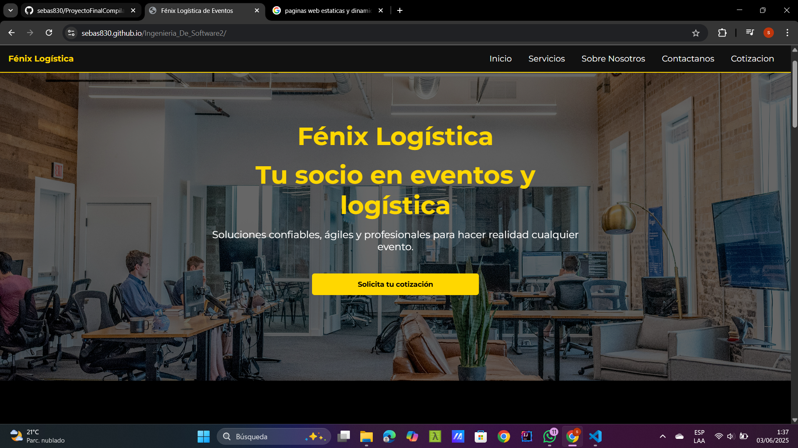
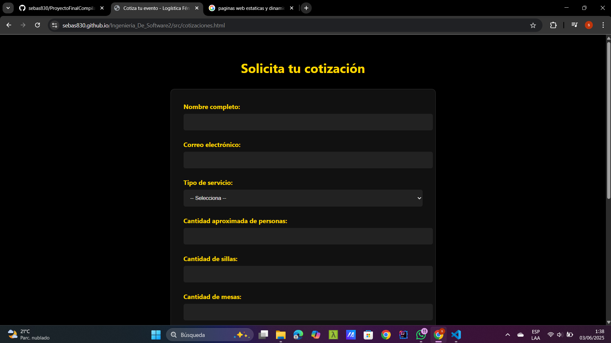

# 🛠️ Proyecto Final Ingenieria De software 2

## 📌 Tabla de Contenidos
- [📄 Descripción](#descripción)
- [✨ Características](#características)
- [🔧 Instalación](#instalación)
- [🚀 Uso](#uso)
- [🧪 Ejemplos](#ejemplos)
- [🧰 Tecnologías](#tecnologías)
- [📜 Licencia](#licencia)
- [👥 Autores](#autores)

## 📄 Descripción

Este proyecto corresponde al trabajo final de la asignatura **Ingeniería de Software II**, donde se implementa una página web informativa para la empresa **Fénix Logística**, dedicada a la planeación y ejecución de eventos corporativos y sociales, donde se pueden realizar sus cotizaciones.

### ➤ ¿Qué problema resuelve?
Ofrece una presencia digital profesional a la empresa Fénix Logística, facilitando la visibilidad de sus servicios, misión, visión y canales de contacto para clientes potenciales.

### ➤ ¿Cuál es su utilidad?
Permite a los usuarios conocer de forma clara y atractiva los servicios que ofrece la empresa, acceder rápidamente a información relevante, establecer contacto con facilidad y consultar de forma práctica el valor del servicio logístico.

## ✨ Características

- Página web estática con diseño responsivo.
- Información clara y estructurada sobre la empresa.
- Secciones de misión, visión, servicios y contacto.
- Compatible con navegadores modernos.
- Despliegue web a través de GitHub Pages.
- Código limpio y organizado, ideal para mantenimiento futuro.

## 🔧 Instalación

Asegúrate de tener los siguientes programas descargados:
1. Visual Studio Code  
2. Node.js  

Para la instalación y ejecución local del programa:
1. Dirígete al link del repositorio: https://sebas830.github.io/Ingenieria_De_Software2/
2. Selecciona **<> Code** y posteriormente **Local**. En la parte inferior izquierda se encuentra el archivo .ZIP para descargar.  
3. Extrae la carpeta.  
4. Abre la carpeta descargada desde Visual Studio.  
5. Presiona Ctrl+J para abrir la consola.  
6. Ejecuta este comando para el servidor en Node.js: npm install -g serve  
7. Luego, ejecuta el siguiente comando para iniciar el servidor: serve .
8. Presiona Ctrl + clic en el enlace que aparece en la terminal (por defecto será: http://localhost:3000)
9. en este ultimo paso ya se estaria ejecutando su programa.

Para solo ejecucion del programa ingrese al siguiente Link:
    https://sebas830.github.io/Ingenieria_De_Software2/

## 🚀 Uso

**Funcionalidades de la Página:**
- Explorar información institucional de Fénix Logística.
- Ver los servicios ofrecidos por la empresa.
- Navegar entre las diferentes secciones mediante el menú principal.
- Realizar cotizaciones rápidas manualmente.
- Contactar al asesor para una atención más personalizada.

### Instrucciones de Uso:
1. Abre la página desde el navegador.
2. Usa el menú de navegación para moverte entre **Inicio**, **Misión**, **Visión**, **Servicios**, **Contacto** y **Cotización**.
3. En la sección de contacto puedes visualizar la información para comunicarte con la empresa.

## 🧪 Ejemplos

Puedes ver un ejemplo funcionando en el siguiente enlace:  
🔗 [Demo en GitHub Pages](https://sebas830.github.io/Ingenieria_De_Software2/)

  

## 🧰 Tecnologías

- **HTML:** estructura del cuerpo de la página.  
- **CSS:** diseño frontend del sitio web.  
- **(Futuro)** JavaScript: para interactividad en la web.  
- **Node.js:** para levantar el servidor local.  
- **GitHub Pages:** para despliegue en línea.

## 📜 Licencia

Se permite solo para uso educativo. No puede ser vendido; sin embargo, puede ser usado externamente y modificado.

## 👥 Autores

📧 **sebasramirez830@gmail.com**  
🐙 GitHub: [@sebas830](https://github.com/sebas830)

📧 **mariaalejandrareina122@gmail.com**  
🐙 GitHub: [@Mari-R122](https://github.com/Mari-R122)
